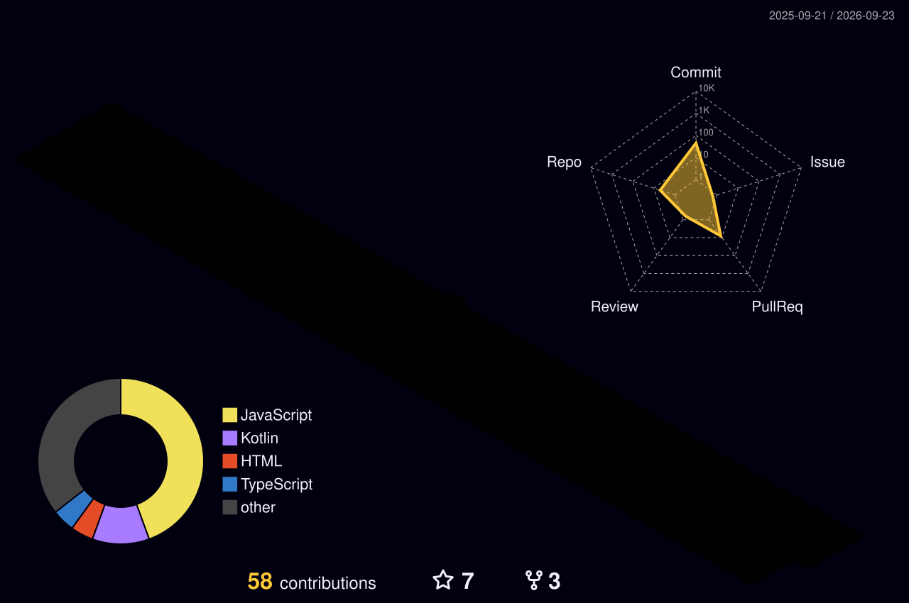

<!---### Hello, World! 👋 --->

  

#### 🎓 Estudante de Sistemas de Informação  
#### 📱 Desenvolvedor Android

## Sobre mim
  Sou apaixonado por tecnologia, design e tudo o que envolve criar experiências que realmente fazem diferença para o usuário.
  Atualmente, estou imerso no universo do Android moderno, estudando Jetpack Compose, Kotlin e arquiteturas limpas para construir apps eficientes, escaláveis e com interfaces agradáveis.

  Acredito que cada linha de código é uma oportunidade de aprendizado — e é isso que me motiva a transformar ideias em aplicativos funcionais, bonitos e cheios de propósito.
 

## Tecnologias e Ferramentas:

  <h3>📱Desenvolvimento Mobile</h3> 

 

 

  <h3>💻Ferramentas que utilizo</h3> 

 

## ⚡ GitHub Estatísticas

<table align="center">
  <tr>
    <td align="center">
      
    </td>
    <td align="center">
      
    </td>
  </tr>
</table>

  ###

  
  

 
 
 
## 🏆 Conquistas

  

##

  
  
  
- Obrigado pela visita.
- Aproveite!! o/

