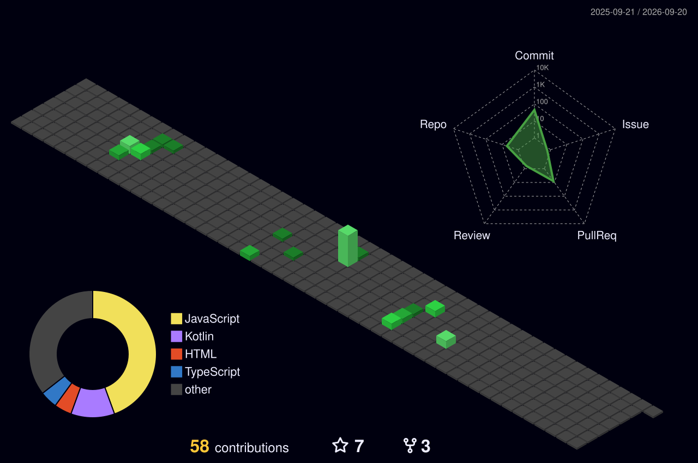

<!---### Hello, World! 👋 --->

  

## About me
🎓 Sou Wellington Henrique, atualmente faço Sistema de Informação na Universidade Paranaense(UNIPAR) com foco em desenvolvimento mobile Android.

🎯 Tenho como objetivo principal desenvolver soluções criativas e inovadoras, buscando sempre facilitar o acesso de forma prática e intuitiva.

🚀 Atualmente em busca de me tornar um profissional capacitado para desenvolver aplicativos mobile eficientes e com uma experiência de usuário intuitiva, combinando habilidades em desenvolvimento Android e princípios de UI/UX Design.
 

<table align="center">
  <tr>
    <td align="center">
      
    </td>
    <td align="center">
      
    </td>
  </tr>
</table>

  ###

  

<!----  
 !-->

## Tech Stack:

   

  

<!--
  -->

<!--- 

 --->

<!----

 --->

 
 

 
##
   

     
  

<!----[snake gif](https://github.com/WellingtonHSL/WellingtonHSL/blob/output/github-contribution-grid-snake.svg)
  
 --->
